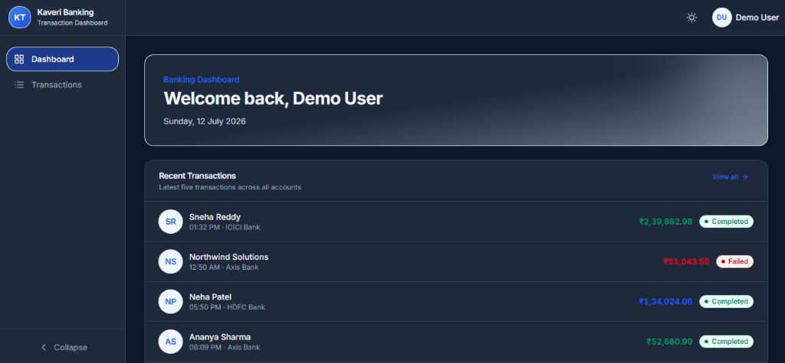
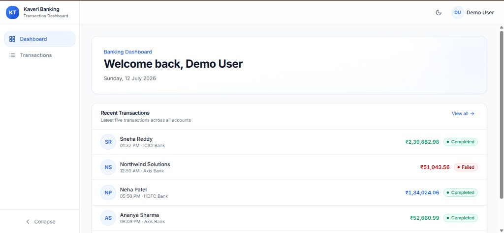
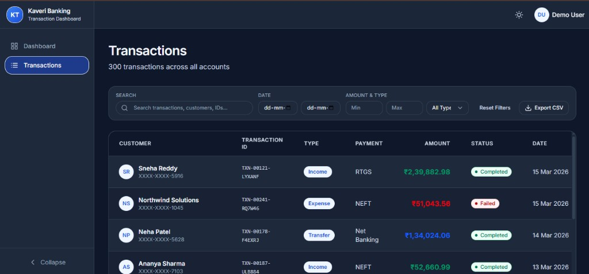
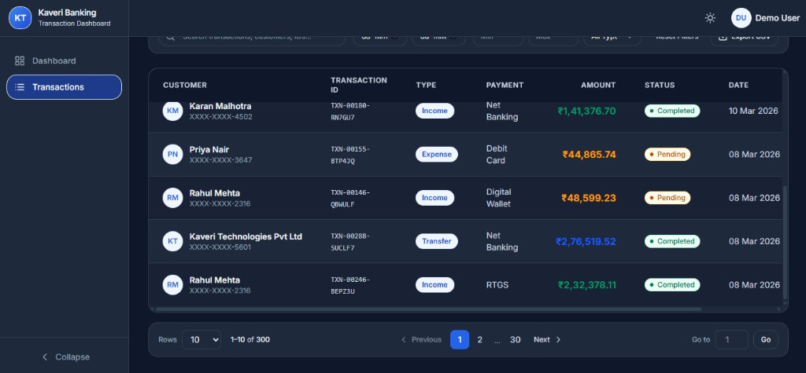
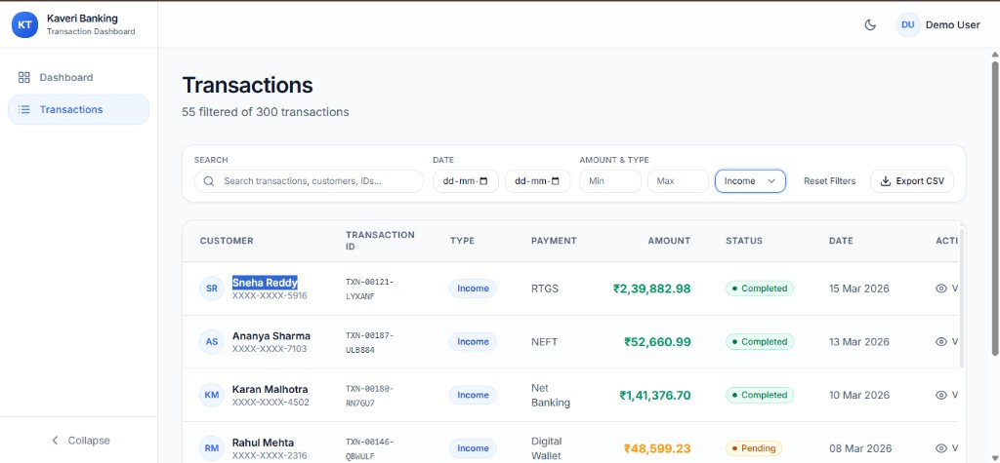
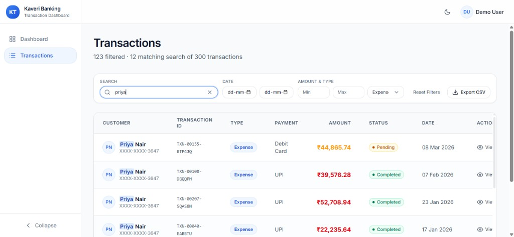
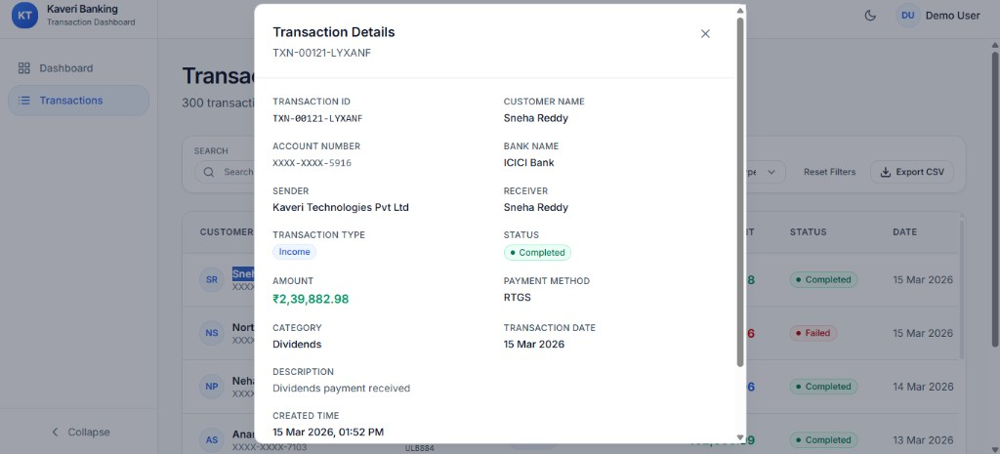
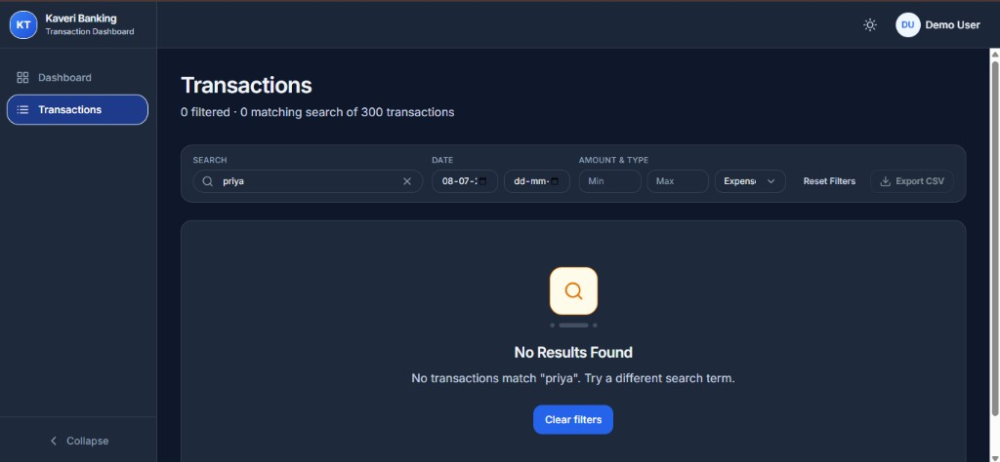

# Kaveri Banking — Transaction Dashboard

A modern banking transaction dashboard built with React and Vite. It provides a clean overview of recent activity and a full transactions workspace with search, filters, pagination, and CSV export — all powered by mock data (no backend required).


## Screenshots

### Dashboard

| Dark mode | Light mode |
|-----------|------------|
|  |  |

### Transactions

| Dark mode — table & filters | Dark mode — pagination |
|-----------------------------|------------------------|
|  |  |

| Light mode — filters | Light mode — search |
|----------------------|-------------------|
|  |  |

### Transaction details



### Empty state



## Features

### Dashboard
- Welcome header with demo user profile
- Recent transactions list (latest 5 records)
- Quick link to the full Transactions page
- Loading skeletons for a smooth first paint

### Transactions
- **Search** — debounced search across customer name, transaction ID, account number, payment method, and category
- **Filters** — date range, amount range (min/max), and transaction type
- **Table** — sortable columns with status badges and formatted currency/dates
- **Details modal** — view full transaction information
- **Pagination** — page navigation, rows per page, and go-to-page controls
- **Export** — download filtered/search results as CSV

### UI & UX
- Responsive sidebar layout (collapsible on desktop, drawer on mobile)
- Dark mode by default with light/dark theme toggle (persisted in `localStorage`)
- Toast notifications for export success/errors
- Empty states when no results match search or filters

## Tech Stack

| Layer | Tools |
|-------|-------|
| Framework | React 19, React Router 7 |
| Build | Vite 8 |
| Styling | Tailwind CSS v4, CSS custom properties |
| Data | Mock JSON / generated transactions (300 records) |
| Utilities | `date-fns`, `papaparse` (CSV export), `react-hot-toast` |
| Icons | `react-icons` (Feather set) |

## Getting Started

### Prerequisites

- **Node.js** 18+ (20+ recommended)
- **npm** 9+

### Installation

```bash
git clone <repository-url>
cd Banking_Transaction_app
npm install
```

### Development

```bash
npm run dev
```

Open [http://localhost:5173](http://localhost:5173). The app redirects `/` to `/dashboard`.

### Build

```bash
npm run build
```

Output is written to `dist/`.

### Preview production build

```bash
npm run preview
```

### Lint

```bash
npm run lint
```

## Project Structure

```
Banking_Transaction_app/
├── docs/
│   └── screenshots/     # README images (dashboard.png, transactions.png, etc.)
├── public/              # Static assets, _redirects, favicon
├── src/
│   ├── components/
│   │   ├── common/      # Shared UI (Avatar, Button, Modal, Pagination, etc.)
│   │   ├── dashboard/   # Dashboard-specific components
│   │   └── transactions/# Table, toolbar, filters, details modal
│   ├── constants/       # Routes, filters, status, pagination, theme tokens
│   ├── context/         # Theme and sidebar providers
│   ├── data/
│   │   ├── transactions.js
│   │   └── mockUser.json
│   ├── hooks/           # useSearch, usePagination, useTransactionFilters, etc.
│   ├── layouts/         # DashboardLayout, Sidebar, Navbar
│   ├── pages/           # DashboardPage, TransactionsPage, NotFoundPage
│   ├── styles/          # Theme CSS variables (light/dark)
│   └── utils/           # Formatting, filtering, CSV export, debounce helpers
├── netlify.toml
└── vite.config.js
```

### Path aliases

Configured in `vite.config.js`:

| Alias | Path |
|-------|------|
| `@components` | `src/components` |
| `@pages` | `src/pages` |
| `@hooks` | `src/hooks` |
| `@utils` | `src/utils` |
| `@constants` | `src/constants` |
| `@data` | `src/data` |
| `@layouts` | `src/layouts` |
| `@context` | `src/context` |

## Data Flow (Transactions Page)

```
transactions (mock data)
    ↓
useTransactionFilters  →  filter by date, amount, type
    ↓
useSearch              →  debounced text search
    ↓
usePagination          →  slice for current page
    ↓
TransactionsTable      →  render + details modal
```

Filters apply automatically on change. **Reset** clears filters and search. **Export CSV** exports the current filtered + searched result set.

## Mock Data

- **300 transactions** generated in `src/data/transactions.js` with realistic Indian banking context (HDFC, ICICI, UPI, NEFT, etc.)
- **Demo user** in `src/data/mockUser.json` (`Demo User`, `demo@kaveritech.com`)
- No API calls — suitable for demos, assignments, and UI development

To change the transaction count, edit `TRANSACTION_COUNT` in `src/data/transactions.js`.

## Deployment (Netlify)

The project includes SPA routing support for client-side routes:

- `public/_redirects` — `/* /index.html 200`
- `netlify.toml` — build command, publish directory, and redirect rule

Deploy steps:

1. Connect the repo to Netlify
2. Build command: `npm run build`
3. Publish directory: `dist`
4. Deploy

Direct navigation to `/dashboard` or `/transactions` works after deploy (no 404 on refresh).

## Routes

| Path | Page |
|------|------|
| `/` | Redirects to `/dashboard` |
| `/dashboard` | Dashboard overview |
| `/transactions` | Full transactions workspace |
| `*` | 404 page |

## Theme

- Default theme: **dark**
- Toggle via the sun/moon icon in the navbar
- Preference stored under `kaveri-theme` in `localStorage`
- Theme is applied before React mounts (inline script in `index.html`) to avoid a flash of the wrong theme

## License

Private project — all rights reserved.
